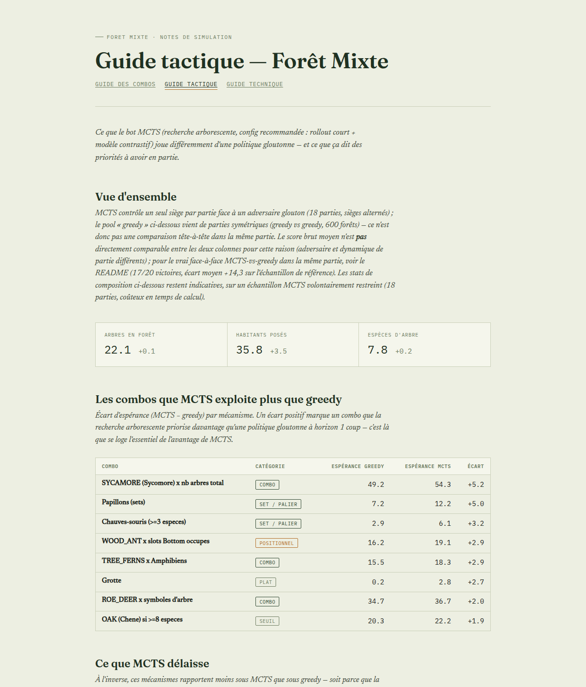
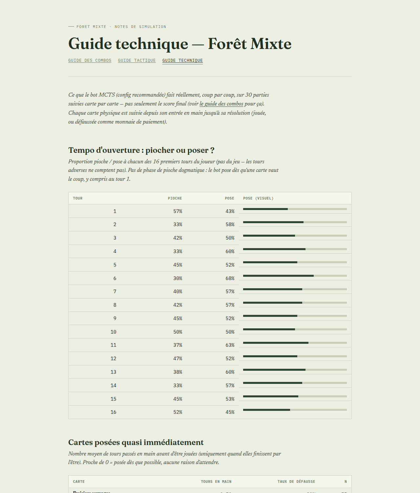

# Forêt Mixte : moteur, simulateur et recherche

Implémentation Python du jeu de cartes *Forêt Mixte* (Lookout Games / Asmodee) :
moteur de scoring vérifié contre une référence externe, simulateur de partie
complet, et plusieurs politiques de décision (glouton, faisceau, MCTS).

Les données de cartes sont **extraites mécaniquement** depuis
[soldag/forest-shuffle-scoring](https://github.com/soldag/forest-shuffle-scoring)
(`tools/gen_cards.py` → `cards.py`), pas recopiées à la main, pour éviter toute
divergence silencieuse avec les vraies règles du jeu. Le moteur de scoring est
validé contre cette référence sur 1700 forêts aléatoires (`tests/test_rules.py`).

## Sommaire

- [Installation](#installation)
- [Structure du projet](#structure-du-projet)
- [Le moteur de scoring](#le-moteur-de-scoring)
- [Performance](#performance)
- [Politiques de décision](#politiques-de-décision)
- [Fonctions de valeur pour MCTS](#fonctions-de-valeur-pour-mcts)
- [Force intrinsèque des cartes](#force-intrinsèque-des-cartes)
- [Guides de jeu (combos et tactique)](#guides-de-jeu-combos-et-tactique)
- [Limitations connues](#limitations-connues)

## Installation

```bash
pip install -r requirements.txt  # numpy, scikit-learn, joblib (pour reference/)
python -m pytest tests/ -q       # 23 tests, dont 1700 forêts aléatoires
```

Usage minimal du moteur :

```python
from engine import Forest, TREE_ID, DWELLER_ID, POS_ID, score_players

f = Forest()
i = f.add_tree(TREE_ID["BEECH"])
f.add_dweller(i, POS_ID["Right"], DWELLER_ID["ROE_DEER"])
print(f.score())

# En multijoueur, laisser score_players résoudre les majorités
# (LINDEN, pic épeiche) : Forest.score() seul les suppose acquises, ce qui
# n'est correct qu'en solo.
print(score_players([f_joueur1, f_joueur2]))
```

Simuler et confronter des politiques :

```bash
python bench.py scoring                          # micro-benchmarks du moteur
python bench.py policies                          # greedy vs beam
python bench.py mcts 400 40 8                      # MCTS (rollout) vs greedy
python bench.py mcts_pairwise_hybrid 300 8 10       # MCTS (config recommandée) vs greedy
```

## Structure du projet

| Fichier | Rôle |
|---|---|
| `cards.py` | Données des 58 cartes. **Généré**, ne pas éditer à la main. |
| `tools/gen_cards.py`, `tools/base_cards.json` | Extraction depuis le dépôt de référence, sortie brute pour diff. |
| `scoring_ref.py` | Oracle : transcription littérale du moteur TypeScript de référence. |
| `engine.py` | Moteur de scoring : compteurs incrémentaux, undo, `Forest.score()`. |
| `game.py` | Simulateur : deck physique, tours, hiver, paiement, effets de carte. |
| `search.py` | Politiques : greedy, beam, MCTS à information imparfaite. |
| `bench.py` | Benchmarks reproductibles (scoring, politiques, MCTS). |
| `tests/test_rules.py` | Oracle + cas unitaires + fuzzing (1700 forêts aléatoires). |
| `run_narrated_hybrid.py` | Rejoue une partie MCTS coup par coup (main, alternatives explorées, score). |
| `run_stats_hybrid.py` | Statistiques agrégées (fréquence de jeu par carte) sur N parties MCTS. |
| `reference/value_policy.py` | Fonctions d'évaluation de feuille (`leaf_eval`) pour MCTS. |
| `reference/gen_pairwise_dataset.py`, `train_pairwise_model.py` | Génère et entraîne le modèle de valeur contrastif linéaire (`pairwise_model.joblib`, celui utilisé par défaut). |
| `reference/train_pairwise_mlp.py` | Variante non linéaire (réseau siamois) du modèle contrastif -- testée et non retenue, voir `reference/MODELS.md`. |
| `reference/gen_bootstrap_dataset.py`, `train_bootstrap_model.py`, `bench_bootstrap.py` | Pilote de bootstrap MCTS façon AlphaZero (auto-jeu MCTS + cible = stats de l'arbre, au lieu d'auto-jeu greedy + rollout) -- 2 itérations testées, progrès net entre les deux (quasi-parité contre B au 2e essai) mais **pas encore promu** (ne bat pas encore le modèle officiel), voir `reference/MODELS.md`. |
| `reference/winner_only_experiment.py` | Teste l'entraînement d'un modèle de valeur absolu sur les états du seul joueur GAGNANT de chaque partie -- testé et écarté (pire que la baseline offline, quasi pile ou face pour départager deux coups), voir `reference/MODELS.md`. |
| `reference/MODELS.md` | Index des fichiers `.joblib`/`.npz` de `reference/` : lequel est chargé par défaut, lesquels sont des sauvegardes historiques et pourquoi. |
| `reference/card_strength.py`, `card_strength_mcts.py` | Force intrinsèque des cartes par retrait contrefactuel. |
| `reference/features.py`, `gen_value_dataset.py`, `train_value_model.py` | Modèle de valeur absolu (MLP), voir [limitations](#fonctions-de-valeur-pour-mcts). |
| `reference/bonus_value_experiment.py` | Valeur en points du déclenchement du bonus jumelles (paiement avec/sans le bon symbole, même état). |
| `reference/diagnose_value_bias.py` | Diagnostic : le modèle de valeur est-il biaisé sur les états hors distribution d'entraînement (branches spéculatives que MCTS explore) ? |
| `reference/free_pose_value_experiment.py` | Valeur en points d'utiliser effectivement une pose gratuite plutôt que de la décliner (`skip_effect`). |
| `reference/marginal_value_experiments.py` | Valeur marginale isolée d'un rejeu forcé et d'une carte gratuite (aveugle vs connue en Clairière), à seed commune. Voir la section "Combien vaut un tour, une carte, une pioche ciblée ?" de `docs/combo_guide.html`. |
| `reference/run_combo_log.py` | Batch de parties instrumentées -> `reference/combo_log.jsonl` (un coup = une ligne JSON), source de données de `gen_combo_guide.py`. |
| `reference/bench_heuristics.py` | Tournoi rond-robin {Greedy, MCTS} x {Clairière forte, Clairière faible} : isole l'apport de la politique de décision de celui de l'heuristique de pioche. |
| `reference/gen_combo_guide.py` | Génère `docs/combo_guide.html` et `docs/tactical_guide.html`, voir [guides de jeu](#guides-de-jeu-combos-et-tactique). |
| `reference/gen_technique_guide.py` | Génère `docs/technique_guide.html` (mécanique de jeu coup par coup), voir [guides de jeu](#guides-de-jeu-combos-et-tactique). |
| `docs/combo_guide.html`, `docs/tactical_guide.html`, `docs/technique_guide.html` | Guides de jeu pour un humain : combos classés par espérance, enseignements MCTS vs greedy, mécanique de jeu coup par coup. **Générés**, ne pas éditer à la main. |
| `archive/` | Scripts d'itération et audit remplacés par des versions plus propres, conservés pour l'historique (voir `archive/README.md`). |

## Le moteur de scoring

`engine.py` maintient tous les compteurs dont dépendent les règles de façon
**incrémentale**, à la pose de chaque carte — `score()` ne parcourt jamais la
forêt, il combine directement une trentaine de compteurs. `Forest.copy()`,
`undo_dweller()`/`undo_tree()` (annulation LIFO) permettent d'évaluer un coup
candidat sans copie complète.

### Corrections apportées par rapport à une implémentation naïve des règles

Vérifiées en exécutant le moteur de référence, pas par lecture de la prose des
règles — les cas ci-dessous sont couverts par `tests/test_rules.py`.

| Règle | Erreur | Correction |
|---|---|---|
| ROE_DEER | comptait les arbres de la même espèce | compte toutes les cartes portant le même **symbole** d'arbre, habitants compris (le chevreuil se compte lui-même) |
| COMMON_TOAD | 5 pts par arbre apparié | 5 pts **par crapaud** (10 pts la paire) |
| VIOLET_CARPENTER_BEE | effet non implémenté | fait compter son arbre porteur une fois de plus (`woodyPlantCount`), affecte le seuil MOSS et la majorité du pic épeiche, mais pas `countCardTypes`/`countTreeSymbols` |
| 7 habitants (RACCOON, RED_DEER, ROE_DEER, SQUEAKER, VIOLET_CARPENTER_BEE, WILD_BOAR, WOLF) | déclarés jouables Left **et** Right sur chaque symbole | chaque exemplaire du deck est une variante précise (ex. ROE_DEER : LINDEN/SILVER_FIR en Left, BEECH/BIRCH/HORSE_CHESTNUT en Right) |
| Taille du deck | 250 cartes (chaque moitié d'habitant traitée comme indépendante) | 158 cartes réelles (66 arbres + 96 moitiés Top/Bottom + 88 moitiés Left/Right, appariées aléatoirement à chaque partie) |
| Grotte | +1 point à chaque habitant posé | alimentée uniquement par l'effet du **Raton laveur** (`CAVE_CHOICE_DWELLERS`, action `cave_discard`, choix stratégique exposé à la recherche) |

Deux points signalés à tort dans une revue antérieure du projet et infirmés
par la référence : BROWN_BEAR/MOLE/RACCOON/VIOLET_CARPENTER_BEE ont
volontairement `score: () => 0` (ce sont des cartes à effet de jeu, pas des
règles oubliées — `test_zero_point_cards_are_intentional`), et le plafond de
HORSE_CHESTNUT à 7 (49 points) est correct malgré les 11 exemplaires du deck.

L'erreur de taille de deck était la plus coûteuse pour le simulateur : parties
~60% plus longues, hiver déclenché trop tard, scores hors échelle. Voir
[calibration des scores](#calibration-des-scores) plus bas.

## Performance

Mesures sur une forêt de fin de partie (25 arbres, ~100 habitants), CPU
mono-cœur :

| opération | coût |
|---|---|
| `Forest.score()` | 4,2 µs |
| `Forest.copy()` | 15,4 µs |
| `Forest.delta_dweller()` | 9,3 µs |
| `Game.clone()` | 4,0 µs |
| `Game.legal_actions()` | 13,6 µs |

Une partie complète à 2 joueurs, politique gloutonne : **2,7 ms**.

### Calibration des scores

| | score moyen | maximum |
|---|---|---|
| greedy, 2 joueurs, **sans Clairière** (avant implémentation) | 212 | 277 |
| greedy, 2 joueurs, **avec Clairière** | 650-670 | ~980 |
| bon joueur humain, 2 joueurs (BGA) | 250-320 | |

Les parties duraient ~140 tours au total (70 par joueur) sans Clairière,
~265 avec. L'écart avec le score humain n'est **pas un bug** : vérifié par
instrumentation (conservation exacte des 158 cartes, aucune duplication) et
attribué à une cause précise — `choose_draw_source` (la carte prise dans la
Clairière à chaque pioche) prend systématiquement la moins chère dès que la
Clairière n'est pas vide, ce qui la vide plus vite qu'elle ne se remplit :
sur une partie complète instrumentée, le vidage à 10 cartes (qui borne
mécaniquement la longueur d'une partie humaine, cf. « Planter un Arbre »
ci-dessous) ne se déclenche **jamais**. C'est un choix de bot délibérément
plus optimal qu'un joueur humain moyen sur ce point précis (aucun humain ne
recalcule ce choix carte par carte à 265 reprises), assumé pour l'instant
plutôt que bridé artificiellement — à garder en tête en comparant `bench.py`
à des parties BGA réelles.

## Politiques de décision

`search.py` contient trois politiques.

**greedy** — maximise le gain de score immédiat (delta exact calculé par le
moteur), avec une prime décroissante à la pose d'arbres (sans elle, une
politique gloutonne ne plante jamais d'arbre et plafonne très bas).

**beam** — recherche en faisceau sur la main, adversaires et pioche ignorés.
**Perd contre greedy** en tête-à-tête (182 contre 212 en solo) : regarder
plus loin sans tenir compte de l'incertitude sur-optimise des lignes qui ne
se réalisent jamais.

**MCTS** — arbre persistant, sélection UCT, recherche à information
imparfaite (ISMCTS). Quatre décisions de conception :

1. **Actions identifiées par la carte jouée, pas par son indice en main.**
   L'indice de main se décale à chaque pioche : une action indexée par
   position désignerait des coups différents d'une déterminisation à
   l'autre, et l'arbre agrégerait des statistiques sans rapport. Effet
   secondaire utile : les doublons de main fusionnent, le facteur de
   branchement chute.
2. **Déterminisation par itération** (ISMCTS mono-observateur) : le deck et
   les mains adverses sont rebattus à chaque simulation (les cartes Hiver
   restent dans le deck). Chercher sur l'état réel serait tricher.
3. **Rollouts tronqués et guidés** : politique gloutonne bruitée (epsilon),
   tronquée à une profondeur fixe, puis évaluation par le score courant. Le
   score d'une forêt étant monotone croissant, l'évaluation tronquée est peu
   biaisée.
4. **Récompense = rang normalisé entre joueurs**, pas score brut — le score
   varie d'un facteur 3-5 selon le tirage ; backpropager le score brut ferait
   apprendre la variance du tirage plutôt que la qualité des coups.

Résultats contre greedy, sièges alternés :

| configuration | échantillon | victoires | écart moyen | temps/décision |
|---|---|---|---|---|
| 100 it., profondeur 25, rollout | 8 parties | 4/8 | -21,5 | 49 ms |
| 400 it., profondeur 40, rollout | 8 parties | 6/8 | +4,4 | 286 ms |
| 300 it., rollout classique | 8 parties | 6/8 | +19,1 | 423 ms |
| **300 it., rollout court + modèle contrastif** | 8 parties | **7/8** | **+13,8** | **192 ms** |
| même configuration | 20 parties | **17/20** | **+14,3** | — |

La progression avec le budget de simulation confirme que la recherche paie :
il faut plusieurs centaines de simulations pour dépasser un greedy correct,
cohérent avec un facteur de branchement de plusieurs centaines d'actions.

## Fonctions de valeur pour MCTS

Le rollout tronqué domine le temps par décision (423 ms à 300 itérations).
Objectif : remplacer une partie du rollout par une évaluation moins chère sans
perdre en qualité de décision. Quatre approches testées, dans l'ordre :

**1. Modèle de valeur absolu (MLP sklearn)**, entraîné sur des features de
composition de forêt (proportions par espèce/type, `reference/features.py`).
R²=0,93 en isolation, mais **perd contre greedy** (2/4) une fois branché en
`leaf_eval` sans rollout : le bruit d'estimation du modèle (MAE ~12 pts)
dépasse l'écart réel entre deux coups candidats à un même nœud (~9 pts), donc
MCTS ne peut pas s'en servir pour trancher entre branches.

**2. Modèle contrastif** — au lieu de régresser le gain final absolu (bruit
dominé par tout ce qui reste aléatoire dans la partie), régresser la
*différence* de gain entre deux coups candidats évalués depuis le même état
avec la même suite de pioche (*common random numbers*, pour annuler le bruit
partagé). Première version, sans le score exact en feature : R²=0,045,
quasiment aucun signal (les features en proportions bougent à peine pour un
seul coup). Avec le score exact du candidat ajouté comme feature : R²=0,17,
signal réel mais modeste. Utilisé seul comme `leaf_eval` (produit scalaire,
coût d'inférence quasi nul) : bat greedy (5/8) mais nettement moins bien que
le rollout.

**3. Rollout court (10 coups réels) + modèle contrastif** (config
recommandée, `value_policy.make_pairwise_hybrid_leaf_eval`) — les coups réels
rapprochent l'état de la distribution d'entraînement du modèle et font
émerger la différence marginale entre branches que le modèle seul ne peut pas
voir ; le modèle prend ensuite le relais moins cher qu'un rollout complet.
Résultat : 7/8 puis 17/20 contre greedy, ~2,2× plus rapide que le rollout
classique (192 ms contre 423 ms/décision). C'est la configuration utilisée
par `run_narrated_hybrid.py` et `run_stats_hybrid.py`.

## Force intrinsèque des cartes

`reference/card_strength.py` mesure la contribution de chaque carte à un
score final par **retrait contrefactuel** : rejouer une partie jusqu'au bout,
puis retirer chaque carte posée, une par une, de la forêt finale (via
reconstruction du journal de pose — `undo_dweller`/`undo_tree` sont
strictement LIFO et ne permettent pas un retrait arbitraire) et mesurer la
perte de points. Contrairement au delta immédiat utilisé par `greedy_action`,
cette mesure capture la valeur différée d'une carte (ROE_DEER compte des
symboles posés plus tard dans la partie).

Deux tables sont générées : sous trajectoires greedy (`card_values.py`, 50
parties) et sous trajectoires MCTS (`card_values_mcts.py`, 20 parties).
Constats :

- Les cartes gratuites empilables ou pairables (Lièvre d'Europe, Fourmi des
  bois, Crapaud commun) dominent le classement sous les deux politiques.
- La contribution marginale des cervidés (ROE_DEER, FALLOW_DEER) est déjà
  bonne sous greedy (25-26 pts, meilleure que la plupart des cartes à coût 1)
  — c'est leur coût de 2 cartes qui les pénalise arithmétiquement, pas un
  déficit de recherche. L'écart mesuré entre greedy et MCTS sur ces cartes
  est réel mais modeste (+2 à +2,5 pts).
- La contribution marginale d'une carte **dépend du contexte stratégique**
  dans lequel elle est jouée, pas seulement de la carte elle-même : sous
  MCTS (forêts plus denses en cartes fortes), le marginal de cartes comme
  WOOD_ANT ou GOSHAWK chute de 8-9 pts par rapport à greedy. Piste non
  explorée : une table conditionnée par une variable de contexte pertinente
  (ex. nombre de symboles déjà posés pour ROE_DEER) au lieu d'une moyenne
  plate par carte — coûterait la même chose à l'usage (lookup en table)
  mais serait un découpage choisi à la main plutôt qu'un modèle générique.
- Tentative d'injecter cette table dans une politique gloutonne
  (`reference/strength_policy.py`, pondération du choix de coup et/ou
  paiement par la carte de plus faible valeur plutôt que par coût facial) :
  résultat au mieux dans le bruit statistique, net négatif dès que le poids
  de la correction augmente. Corriger un delta de score exact avec une
  moyenne globale grossière dégrade la décision plutôt que de l'améliorer —
  même constat que pour le modèle absolu ci-dessus. Le greedy actuel
  (delta exact + prime de plantation) résiste bien aux retouches
  heuristiques locales ; le gain mesurable vient de la recherche
  arborescente, pas d'un greedy affiné.

## Guides de jeu (combos et tactique)

Trois pages HTML, générées depuis des parties simulées, pensées pour un
joueur humain plutôt que pour lire du code :

- **[docs/combo_guide.html](docs/combo_guide.html)** — classe toutes les
  synergies du jeu (une carte × un type, une carte × elle-même, une carte ×
  une position) par **espérance de points** : probabilité que le combo se
  réalise dans une partie, multipliée par son gain quand il se réalise.
  Répond à une question qu'un tableau de règles ne peut pas trancher tout
  seul — *« ce combo a l'air fort sur le papier, mais est-ce qu'il arrive
  souvent, et rapporte-t-il vraiment plus qu'un autre en moyenne ? »* Sert
  de pense-bête pendant une partie (quelles cartes chercher en priorité) et
  de garde-fou contre l'intuition : le Sycomore (score = nb d'arbres) bat
  largement le Lièvre d'Europe (score = nb²) en espérance, alors que le
  second a l'air plus spectaculaire sur le papier — parce que sa condition
  (avoir des arbres) est acquise presque à coup sûr, contrairement à
  empiler plusieurs Lièvres.
- **[docs/tactical_guide.html](docs/tactical_guide.html)** — compare ce
  qu'une recherche MCTS (jeu fort) privilégie par rapport à une politique
  gloutonne (jeu naïf à un coup d'avance), et en tire des principes de jeu
  concrets (ex. les combos liés à une ressource abondante battent les
  combos-vedettes ; les seuils binaires ne valent pas la peine d'être
  sur-investis). Utile pour comprendre *pourquoi* un coup gagne à long
  terme, pas seulement lequel.
- **[docs/technique_guide.html](docs/technique_guide.html)** — descend
  encore d'un cran : pas la composition finale des forêts, mais chaque
  carte suivie individuellement, coup par coup, depuis son entrée en main
  jusqu'à sa résolution (jouée ou défaussée en paiement). Répond à des
  questions de mécanique de jeu qu'un score final ne peut pas trancher —
  *faut-il piocher ou poser en début de partie ? quelles cartes se posent
  sans réfléchir dès qu'elles apparaissent ? lesquelles finissent presque
  toujours en monnaie d'échange ? combien de cartes garde-t-on vraiment en
  main ?* Constat notable : pas de phase d'ouverture dogmatique (le bot
  pose dès le tour 1 s'il y a une carte qui vaut le coup), une main tenue
  très mince (médiane à 2 cartes, tombe régulièrement à 0), et des arbres
  coûteux (Marronnier, Chêne, Sapin Douglas) qui finissent défaussés plus
  souvent que plantés une fois la diversité d'espèces déjà acquise.

Les trois pages s'ouvrent directement dans un navigateur (aucun serveur
requis, aucune dépendance) et se renvoient les unes aux autres par un lien
en haut de page. GitHub n'affiche pas de rendu pour un fichier `.html`
(juste le code source), d'où les aperçus ci-dessous : cliquer dessus (ou
sur les liens plus haut) ouvre la vraie page interactive, après avoir
cloné ou téléchargé le dépôt.

<a href="docs/combo_guide.html"></a>

<a href="docs/tactical_guide.html"></a>

<a href="docs/technique_guide.html"></a>

Le guide des combos et le guide tactique sont générés par
`reference/gen_combo_guide.py`, qui rejoue les parties, décompose
`Forest.score()` terme par terme (vérifié égal au score réel du moteur à
chaque forêt) et agrège les statistiques :

```bash
python reference/gen_combo_guide.py                  # 300 parties greedy + 18 MCTS (~4 min)
python reference/gen_combo_guide.py 50 4 100          # échantillon réduit, plus rapide
```

Le guide technique est généré séparément par `reference/gen_technique_guide.py`,
qui instrumente des parties MCTS coup par coup (suivi de chaque carte
physique par identité Python, pas seulement l'état final) :

```bash
python reference/gen_technique_guide.py               # 30 parties MCTS, 150 it. (~6 min)
python reference/gen_technique_guide.py 10 100         # échantillon réduit, plus rapide
```

## Limitations connues

**Clairière et Grotte** (implémentées, `game.py`) : les cartes défaussées en
paiement rejoignent `Game.clearing` (zone commune face visible), vidée
au-delà de 10 cartes (cartes perdues, pas remélangées). À chaque pioche du
jeu — tour normal ou effet de carte — le joueur peut prendre une carte
connue de la Clairière plutôt que piocher à l'aveugle dans le deck
(`Game._draw_one`). **Planter un Arbre alimente aussi la Clairière depuis le
deck** (`_plant_tree_feeds_clearing`), en plus des cartes de paiement : c'est
cette règle qui vide le deck et remplit la Clairière assez vite pour borner
la longueur d'une partie humaine — sous un bot glouton qui vide la Clairière
plus vite qu'elle ne se remplit, ce frein ne s'enclenche quasiment jamais
(voir [calibration des scores](#calibration-des-scores)). L'Ours brun
(`CLEARING_TO_CAVE_DWELLERS` dans `engine.py`) vide inconditionnellement la
Clairière dans sa Grotte à la pose ; si payé avec le bonus jumelles, il
pioche 1 carte de plus et rejoue un tour (comme le Loup). QUELLE carte
prendre dans la Clairière reste une heuristique (`choose_draw_source`, prend
la moins chère), pas une décision de l'arbre — l'exposer multiplierait le
facteur de branchement sur l'action la plus fréquente de la partie.

Non implémenté côté règles :

- **Bonus de paiement par couleur** pour les cartes qui n'ont pas encore été
  câblées, et **moteurs de pioche des champignons** restants.
- **Paiement, et choix de la carte de Clairière à prendre, comme décisions de
  l'arbre** — aujourd'hui des heuristiques (`choose_payment`,
  `choose_draw_source`), pas des nœuds de recherche. C'est le plus gros trou
  de modélisation restant pour la qualité de jeu.
- **Choix de la moitié sacrifiée** — jouer une moitié de carte perd l'autre ;
  décision réelle actuellement prise par « la première qui correspond ».
- **Parallélisation racine** (multiprocessing) — facteur proche du nombre de
  cœurs, sans changement d'algorithme, non implémenté.
- **3+ joueurs** — le moteur supporte N joueurs, mais MCTS n'a été validé
  qu'à 2 (récompense par rang, backup de valeur non testé en configuration
  non-alternée).

## Garde-fou

`tests/test_rules.py` compare le moteur au moteur de référence sur **1700
forêts aléatoires** (dont 200 de taille fin de partie), en plus des cas
unitaires repris du dépôt de référence.
